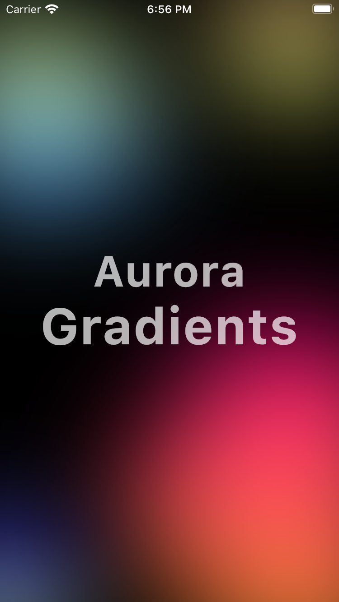

# Aurora

Aurora is a flutter package to create [aurora](https://youtu.be/Y3VJTnmJEgM) gradient shades in your mobile app .



## Install
```yaml
dependencies:
  aurora: ^0.0.1
```

## Usage
```dart
import 'package:aurora/aurora.dart';

Aurora(
  size: 300,
  colors: [Color(0xFFfbd07c), Color(0xFFf7f779)],
  blur: 200
)
```

## Full example

```dart
import 'package:aurora/aurora.dart';
import 'package:flutter/material.dart';
import 'package:flutter/services.dart';

void main() {
  runApp(MyApp());
}

class MyApp extends StatelessWidget {
  @override
  Widget build(BuildContext context) {
    return MaterialApp(
      title: 'Aurora',
      home: HomeScreen(),
      debugShowCheckedModeBanner: false,
    );
  }
}

class HomeScreen extends StatelessWidget {
  const HomeScreen({Key key}) : super(key: key);

  @override
  Widget build(BuildContext context) {
    final TextStyle style = TextStyle(
        fontSize: 48,
        fontWeight: FontWeight.bold,
        color: Colors.white.withOpacity(0.7),
        letterSpacing: 1.2);

    return AnnotatedRegion<SystemUiOverlayStyle>(
      value: SystemUiOverlayStyle.light
          .copyWith(statusBarColor: Colors.transparent),
      child: Scaffold(
        backgroundColor: Colors.black,
        body: Stack(
          children: [
            Positioned(
                top: -10,
                left: -100,
                child: Aurora(
                  size: 300,
                )),
            Positioned(
                top: -50,
                right: -50,
                child: Aurora(
                  size: 200,
                  colors: [Color(0xFFfbd07c), Color(0xFFf7f779)],
                )),
            Positioned(
                bottom: -100,
                right: -300,
                child: Aurora(
                  size: 600,
                  colors: [Color(0xFFff0f7b), Color(0xFFf89b29)],
                )),
            Positioned(
                bottom: -50,
                left: -100,
                child: Aurora(
                  size: 200,
                  colors: [Color(0xFF595cff), Color(0xFFc6f8ff)],
                )),
            Positioned.fill(
                child: Center(
              child: Column(
                crossAxisAlignment: CrossAxisAlignment.center,
                mainAxisAlignment: MainAxisAlignment.center,
                children: [
                  Text(
                    "Aurora",
                    style: style,
                  ),
                  Text(
                    "Gradients",
                    style: style.copyWith(fontSize: style.fontSize + 8),
                  ),
                ],
              ),
            )),
          ],
        ),
      ),
    );
  }
}
```
